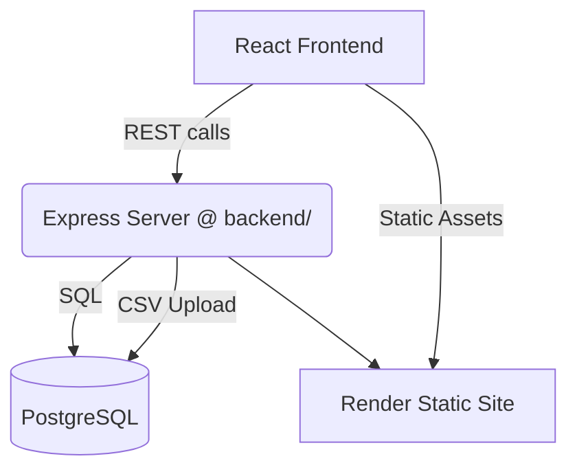

# MLB Contract WAR Calculator (Beta)

**⚠️ BETA VERSION**: This application is in active development. Features may change, and bugs may exist.

Badder-Calc 2 is a full-stack web application that helps baseball fans and analysts evaluate the **dollar value of player contracts and team payrolls** using advanced sabermetric metrics such as WAR (Wins Above Replacement) and wRC+.  
The project powers [BadderSports.com](https://baddersports.com) & the Swing Badder podcast, providing an easy way to answer the eternal question: **"Did we overpay?"**

---

## 📑 Table of Contents
1. [Live Demo](#live-demo)
2. [Features](#features)
3. [Quick Start](#quick-start)
4. [CSV Import / Export](#csv-import--export)
5. [Roadmap](#roadmap)
6. [Contributing](#contributing)
7. [License & Ownership](#license--ownership)
8. [Disclaimer](#disclaimer)
9. [Credits](#credits)

---

## Live Demo
A public beta is hosted on **Render**:

👉 https://contract-war-calculator.onrender.com/

Back-end API (may spin down on free tier):  
👉 https://badder-calc-backend.onrender.com

---

## Features

### 🧮 Three Calculator Modes
1. **WAR Calculator** – Compare player salary to fWAR, bWAR or an average of both.
2. **wRC+ Calculator** – Convert offensive production to dollar value (position-adjusted).
3. **Team Analyzer** – Evaluate an entire payroll, project wins, and surface surplus value.

### 🔄 Admin Dashboard
* Import / export **CSV** files for players & teams.
* Inline editing with validation and duplicate detection.
* Bulk operations & history panel.

### 💎 Extras
* URL-shareable calculations.
* PWA: offline support & home-screen installation.
* Fully responsive UI built with **React 18 + Vite**.

---

## Architecture

* **Frontend (src/**) – React, Vite, Tailwind CSS.
* **Backend (backend/**) – Express 4, PostgreSQL (via `pg`), dotenv, CORS.
* **Database** – Two tables (`players`, `teams`) created automatically on server start.

---

## Quick Start
Requires Node >= 18.

```bash
git clone https://github.com/harnischllc/badder-calc-2.git
cd badder-calc-2
npm install
npm run dev   # open http://localhost:5173
```
> Don’t like Docker? See the manual setup below.

<!-- Backend-specific setup and environment variables intentionally omitted -->

---

## CSV Import / Export
The Admin Dashboard accepts CSV files with the following headers:

### Players
| name | playerId | season | position | war | fwar | bwar | wrcPlus | salary |
|------|----------|--------|----------|-----|------|------|---------|--------|

### Teams
| teamName | season | totalPayroll | activePayroll | teamWar |
|----------|--------|--------------|---------------|---------|

Validation rules are enforced server-side (e.g. salary 0-1000 million, WAR −10-20).  
Duplicate `(playerId, season)` or `(teamName, season)` pairs are **skipped automatically** and reported back to the UI.

---

## Roadmap
- [ ] Live salary & WAR data feeds (FanGraphs API)
- [ ] Multi-year contract analysis & visualizations
- [ ] Autocomplete player / team search
- [ ] Trade value calculator
- [ ] NBA / NFL / NHL versions

---

## Contributing
PRs are very welcome! To get started:
1. Fork the repo & create a feature branch.
2. Install dependencies & run the dev server (`npm install && npm run dev`).
3. Run `npm run lint` (ESLint strict) and add tests where appropriate.
4. Submit a pull request with a clear description & screenshots.

Please open an issue first if you plan a large feature – we can coordinate on scope.

---

## License & Ownership

© 2024–2025 Harnisch LLC. All rights reserved.

This project is developed by **Harnisch LLC** in partnership with the BadderSports network, including SwingBadder.

The code is viewable for transparency and educational purposes. All rights to commercial use, resale, branding, and derivative works remain with Harnisch LLC and BadderSports. Unauthorized use of the SwingBadder or BadderSports names or likenesses is prohibited.

For licensing inquiries: eric@ericharnisch.com

---

## Disclaimer

This tool is for entertainment and educational purposes. Calculations are estimates based on publicly available data and simplified models. Always consider full context when evaluating contracts.

---

## Credits

Created for [BadderSports.com](https://baddersports.com) | Follow [@swingbadderpodcast](https://www.youtube.com/channel/UCvkFXHG5mZyQfsmmf7aU5lQ)

---

**Version**: 0.3.0-beta | **Last Updated**: July 2025
